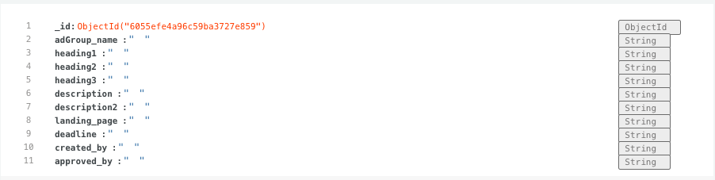

# Ad Reviewer - MS3
## Ad Reviewer is as service that I missed when I worked at ad agencys earlier. It is a easy to use service that let clients proof/correct ads form the agencys without e-mails sending back and fourth. It is easy to use and with right tweaks it could be a great tool for ad agencys. 
Ad agencys can add content for Google Ads and then their clients can approve or comment them, instead of sending emails.  
----
## UX
## Project Goals
Tha main goal with this project was to build a service that filled a need, both for ad agencys and their clients. To build something that could save both time and money for people.  

## User/client Goals 
* As a client, I want to have the abbility to approve tha ad suggestions i like, and comment with feedback instead of sending e-mails. 

## User/Client stories 
* As a client, I want it to be easy for me to registrate. 
* As a client, I want it to be easy for me to login.  
* As a client, I want it to clear what to do when I logged in. 
* As a client, I want to be able to see and correct ad suggestions.  
* As a client, I want it to be easy for me to take action when i see a add suggestion. 
* As a client, I want it to easy for me to find the ads. 

## Site Owner Goals
* As a site owner, I want as many registrated agencys as possible. 
* As a site owner, I want Ad Reviewer to be a new standard when correcting ad suggestions. 
* As a site owner, I want the users to be able to use the service without questions for the first time. 
* As a site owner, I want the overall experience to be smooth. 

## User Requirements and Expectations. 
### User Requirements:
* Understand how to registrate and login. 
* Registrate and login. 
* See the actual ads. 
* Approve and comment the Ads. 

### User Expectations 
* Find it easy to registrate
* Find the actual Ads to be approved without any concerns. 
---
## Design Choices
The overall idea with the site was to make it serious and clean without any disturbing elements. I wanted it to have a modern layout, both on desktop and mobiles. 
The main focus was to make it easy for the users to understand it and proceed, without noticing the page itself. Tha faster the better for the client to see the ad suggestions. 

### Fonts
Materilize standard font Roboto is used in different font-weight because its readability and all-aroundness.

#### Logo 
For the logo [Leckerli One](https://fonts.google.com/specimen/Leckerli+One?preview.text_type=custom) has been used.

#### Headings
Roboto has been used in various font-weights and colours. 

#### Paragraph
Roboto hase been used in paragraphs fir its great readability on small devices. 

### Icons 
[Fontawesome](https://fontawesome.com/) has been used for all icons, works great has a wide range of icons. 

### Colours
Tha main colours scheme is white, grey and black. With dashes of dark forrest green, dark brown and orange. The greyscale give it serious and light feeling and the colours made it more intresting. 

---
## Wireframes 
The design for the wireframe is very simple and straight forward. All wireframes is made in [Balsamiq Wireframes](https://balsamiq.com/). 

* Wireframes: [1](/static/images/wireframes/1.png), [2](/static/images/wireframes/2.png), [3](/static/images/wireframes/3.png),[4](/static/images/wireframes/4.png),[5](/static/images/wireframes/5.png),[6](/static/images/wireframes/6.png),[7](/static/images/wireframes/7.png),

---
## Technologies used 
This project have been used a wide mix of Technologies. The foundation is built with html and css with Materilize Libraries. The main focus on this project was to be able to hand data from MongoDB on a efficent way, and for that i have been used Python with Flask framework.

Here is the list:
* **MongoDB**: For storing the data. 
* **HTML**: For structure and content. 
* **CSS**: For styling the content and data.  
* **Javascript/Jquery**: For making collapsble dropdown catch the data insie of it.  
* **Python + Flask**: Build routes and functions. 

### Tools & Libraries 
* **Balsamiq**: for making wireframes. 
* **Git**: for version control among the project.  
* **Git hub**: For storing the project and keeping it safe. 
* **Herokub**: Hosting platform for python etc. 
* **Font awesome**: For alla the clean icons on the site.  
* **Google fonts**: Font for the Logo. 
* **Google devtools**: For responsive testing among the way. 
* **Beutifier**: Clean the code up. 
* **pep8online**: Check the Pepe8 compability. 
* **Materilize**: Smooth and easy to use . 

----
## Features
### Features that have been implemented 
* Navigation
* Registration
* Login function
* Linked to MongoDB database
* Passwords are hashed so they are not shown in the MongoDB
* CRUD-functions. 
* Approve ad button
* Comment ad button
* Admin have access to more pages the ordinary user. 
* Add ad has the same max-length on Headings and description forms like real Google ads. 

### Features that will be implemented in the future
* Function so that you can invite clients without login to see the ads. 
* Get noticed when you have a Ad to approve. 
* Abbility to connect Google Ad account to Ad reviewer. 
* Tablet UX

---
## Testing 
### Validators

#### Html: 
For testing html validation, i have been used [W3 validator](https://validator.w3.org/nu/). No HTML warnings or errors, but it dosen´t accept the jinja expressions and the lack of Doctype when you are using base.html. 

#### CSS:

For testing CSS validation, [W3 CSS validator](https://jigsaw.w3.org/css-validator/) have been used without any warnings or errors. 

#### Speed

Though i want the page to be as fast as possible, I´v been tested it with [Gt Metrix](https://gtmetrix.com/) with the result of: A grade. Perfomance: 93% and structure: 90%.

### User stories
#### As a client, I want it to be easy for me to registrate. 
    When entering the page, the registration button is the main CTA in orange so the user won´t miss it. And it is placed att the end of the menu. 

#### As a client, I want it to be easy for me to login. 
    When entering the page, the registration button The main login box is placed in the middle of the page and are clear without any distractions. Te login button is contrasting to the bacground with a purple color and a icon to clarify that you are moving forward.  

#### As a client, I want it to clear what to do when I logged in.
    When your have clicked logged in, then you will come to the profile page. Directly on the profile page there is instructions on what to do.
 

#### As a client, I want to be able to see and correct ad suggestions.  
    When you click on Ads in the menu, you will see your suggested ads. Right under each ad there is a "Approve" button and "Comment" button with associated icons. After the buttons, theren is also "Edit" and "Delete" is the user want to edit the ad by their own or delete it. 
 

#### As a client, I want it to be easy for me to take action when i see a add suggestion. 
    As mentioned in the user story above, there are buttons in contrasting colors so it would be easy for the user to se what CTA there is. 

#### As a client, I want it to easy for me to find the ads. 
    When your logged in, a how-to guide is shown, with a button direclty to the ads. 

    

* Registration
* Login function
* Linked to MongoDB database
* Passwords are hashed so they are not shown in the MongoDB
* CRUD-functions. 
* Approve ad button
* Comment ad button
* Admin have access to more pages the ordinary user

---

### Features
| Feature        | Expected           | Testing  | Result  |
| ------------- |-------------| -----|-----|
| **Navigation**    | Change page with navigation | Visited all pages with all three navigations with both mobile and desktop. |Works as expected, pages shows. |
| **Registration**    | Registrate and update MongoDB | Registrated users from both desktop and mobile. |Works as expected, DB updates fine. |
| **Login function**      | Log in the user to the page     |   Tested with various users | Works as expected, the user is logged in to the profile page |
| **Hashed passwords in db** | Hashed all passwords in DB so the passwords is not shown    |    Went through all the passwords in db | Works as expected, all passwords are hashed.|
| **CRUD-functions.** | Create, read, update and delete Ads.     |    Tested all the CRUD functions | Works as expected, DB and Ads updates according to plan.  |
| **Approve ad button** | To change the status to "on" in db and show a text string on the right side of the AD when its approved.     |    Tested with multiple Ads and users. | Works as expected, DB updates and string is shown on the right side of the Ad. |
| **Comment ad button** | Insert a comment under the Ads from a field. If no comment is made, the comment sections dosen´t show.     |    Tested to comment various ads | Works as expected, comments is showing. |
| **Admin access** | See all the navigation items in the navbar, and can CRUD-Ad groups.   |    When logged in as Admin eveything shows | Works as expected, the navbar is completed and  |

### Responsivness
Among the process with this project, with every update the Google devolper tool has been used to check its responsiveness. The main focus has been it to works perfect on desktop and great on mobiles because of the user/client. The service target group is clients to Ad agencys and i belive they are mainly using desktop for this type of work, and second mobile. The UX for tablet users is´nt the best, but it will be fixed in future feuatures. 

### Bugs
This project has been filled with small bugs here and there, mostly because I´m new to python, Flask and MongoDB. The major bugs has been a think tank from me, but after som guidance from tutors and troubleshooting for my won it worked pretty well.

There has been two major bugs though:
#### Approve button
Have a hard time to make it work though I did´nt use the @app.route correct. The bug was that I tried to add the function to the get_ads route, but it did´nt find the correct id for it. So After watching edit task in Mini project a few times, finally i got it. 
-   Fix: Added a new route with ID and "$set": update_approve})

**Display Ads for the correct user**

This problem had my brain warm a couple of times. I now what the solution should look like but I troubled among the way. Admin can see all clients ads, but the client can only see their own ads.

-   Fix: The answer was to combine ads and clients with the correct field. Set a if statement for the whole loop that it sess user and the ads client needed to match to show it. 
---
## Data

Collections & Schema: 
### Ads 

### Ad Groups 

### Clients

---
## Deployment
The page is made with Git in combination with Git Hub. For more control of the process I have been commited more often in this project. 

1. Got to [Github](https://github.com/) and sign in with the form in upper right corner.
2. Or, go direct to https://github.com/Carl-Henric/MS2. 
3. In the Tab menu above the content area, click on settings. 
4. Scroll down to the section called Pages, right under the Archives section. 
5. Choose Master Branch from the source dropdown menu.
6. Click to confirm my selection.
7. Now the page is published, see link in blue under the heading ### Git Hub Pages.  

### How to run this project locally (How to clone this project from Github:)
1. Go to https://github.com/Carl-Henric/MS2 
2. Click the “Code”-button with the down arrow and copy the http-address.
3. Open Gitpod and open a new terminal, then click terminal, and new terminal.
4. In the terminal, paste the code and press enter.
5. Voila!

---

## Credits
Code inspiration and help:
* The mini project by Tim Nelson (Code Institute) was my guidance when I got lost. 
* Dropdown javascript script from mini project was used. 
* Code Institut Tutors for guiding me in the right direction when I got lost.  

## Images:
Photo on start page and how to from [Moose Photos](https://www.pexels.com/sv-se/@moose-photos-170195) on [Pexels.com](https://www.pexels.com/sv-se/foto/man-manniskor-barbar-dator-kvinnor-1036641/)